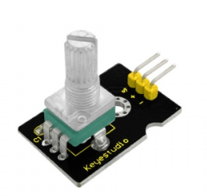
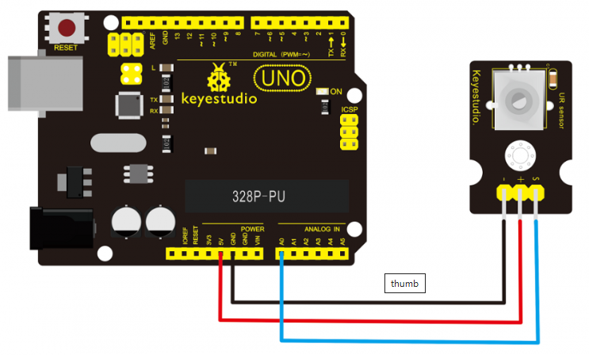
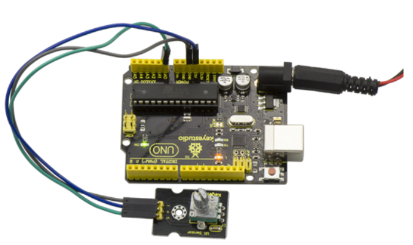

# KS0014 keyestudio Analog Rotation Sensor



## 1. Introduction

This analog Rotation Sensor is arduino compatible. It is based on a potentiometer. Its voltage can be subdivided into 1024, easy to be connected to Arduino with our sensor shield. Combined with other sensors, we can make interesting projects by reading the analog value from the IO port.

## 2. Specification

- Supply Voltage: 3.3V to 5V
- Interface: Analog

## 3. Connection Diagram



## 4. Sample Code

Download Code:  [Code](./Code.7z)

```
void setup()
{
    Serial.begin(9600); //Set serial baud rate to 9600 bps
}

void loop()
{
    int val;
    val=analogRead(0);//Read rotation sensor value from analog 0
    Serial.println(val,DEC);//Print the value to serial port
    delay(100);
}
```

## 5. Result



Done wiring and powered up, upload well the above code, then open the serial monitor and set the baud rate as 9600, finally you will see the analog value. If rotate the knob on the rotation sensor, the value will be changed within 0-1023. Shown below.

